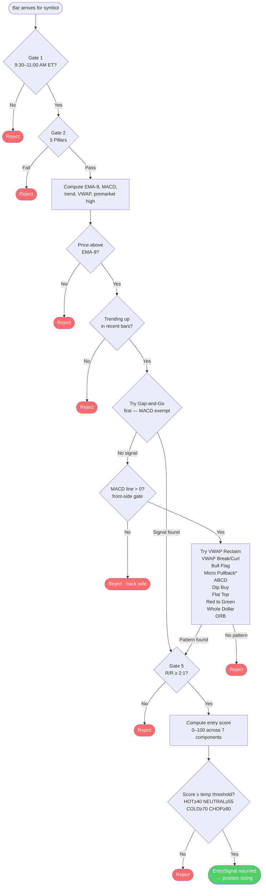
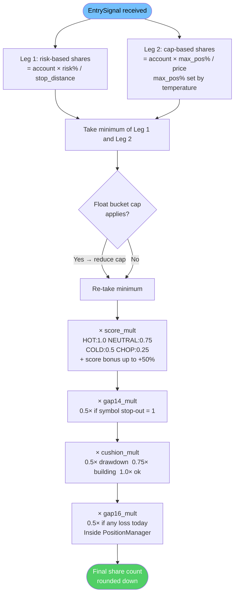
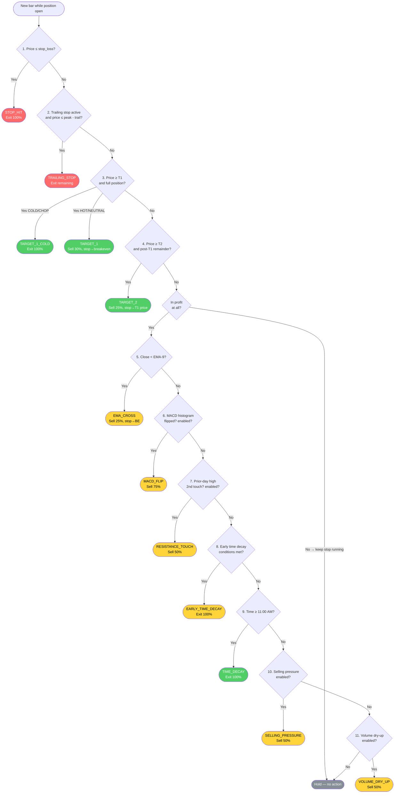
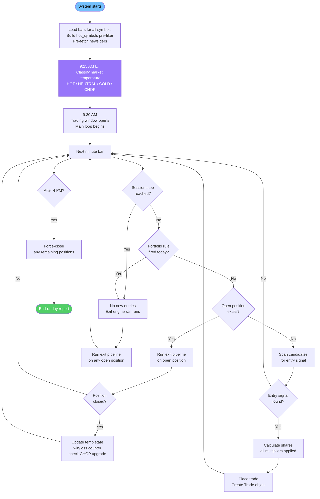

# jTrader Logic Walkthrough

**Purpose:** Plain-English explanation of how jTrader works, end-to-end. For each step: what the code does, why Ross Cameron does it this way, and where in the corpus that reasoning comes from.

**Audience:** Joel (primary). Also serves as a cross-reference document — if the code and the corpus disagree, this document is how we find it.

**Status:** Draft — building section by section.

---

## Section 1: A Day in the Life of a Trade

> *The big picture. What happens from when the system wakes up to when it shuts down. No detail on individual gates yet — just the skeleton of the day.*

---

### Phase 1: Before the Market Opens (Midnight → 8:00 AM ET)

The system is idle. No trades are possible. In the background, the **data collector** has been running since 4 AM, storing bars for ~3,000–4,000 symbols in the database.

**What kind of bars?** Two timeframes, deliberately different:
- **4 AM – 8 AM:** Hourly bars. One bar per hour. Enough to know a stock gapped up and roughly how much — no need for tick-by-tick precision in premarket. Keeps data volume manageable.
- **8 AM – 12 PM:** 1-minute bars. The trading window needs full precision for pattern detection, entry timing, and stop placement.

The reason data collection starts at 4 AM is that premarket price and volume tell you *who the candidates are* before the bell rings. Ross scans premarket every morning to find stocks that have already moved. Corpus evidence shows 8 AM entries are common (FILE 0003: LUCY entered at 8:00 AM, FILE 0007: ENSC entry at 8:00 AM), so his watchlist is effectively built by 8–8:30 AM, well before the 9:30 open.

---

### Phase 2: Building the Candidate List (8:00 AM → 9:25 AM ET)

When the simulation (or live system) starts up, the first thing it does is **load all the data for the day** and run a quick pre-filter to build what's called the **hot_symbols** list.

**What "hot_symbols" means:**
A stock makes it onto this list if it passes two basic checks:
1. Price is between $2 and $20
2. It's up at least 10% from yesterday's close (it's "gapping up")

This is a *loose* filter — it's intentionally broad. The real gates come later. The purpose here is just to throw away 95% of the 4,000 symbols in the database so the system isn't doing expensive work on stocks that have zero chance of being traded.

**Why these two criteria?**
Ross only trades stocks that are moving with momentum. A stock flat at $5 has no edge. A stock up 15% on news has the crowd behind it — buyers chasing, shorts panicking.

**On price range — open question:**
FILE 0001 mentions "$2–$10 price range" as Ross's stated criteria, but corpus data shows he trades much wider. Trades found in corpus spanning:
- Under $2 (e.g. $0.30, $0.66, $0.89 — very cheap stocks, high share count, commission drag risk)
- $2–$10 (dominant band — most trades live here)
- $10–$20 (e.g. $12.50, $14.71, $17.63, $19.16 — less common but present)
- Above $20 (e.g. $34, $42 — rare, specific setups like FILE 0011 DRUG)

Current code uses $1–$20 as the hard filter, which covers the majority. **Open question:** should stocks at the extremes ($1–$2 and $15–$20) require higher confidence to enter? A $19 stock with a 10% gain is structurally less explosive than a $3 stock with the same gain. This could be a scoring engine adjustment rather than a hard filter.

**On float — open question:**
FILE 0001 mentions "sub-1M float" as the ideal, but corpus data shows:
- sub-1M: ideal (FILES 0001, 0004, 0012, 0073 — squeeziest moves)
- low-float (1M–5M): common (FILES 0003, 0007, 0017)
- 1.6M, 4.9M: explicitly recorded (FILES 0028, 0062)
- high-float: Ross trades these occasionally on strong catalysts (FILES 0005, 0008, 0010, 0011)

Current code uses 20M as the hard max. That's a reasonable ceiling. The gradient matters though: sub-1M float should produce more explosive moves and potentially warrant higher confidence scoring than a 15M float on the same setup. The scoring engine partially handles this — float tier is a scoring input.

**How many symbols typically survive the hot_symbols filter?**
On a hot day: 15–40 symbols. On a cold day: 2–5. The count itself feeds into market temperature classification.

After hot_symbols is built, the system also **pre-fetches news** for each of those symbols. Each one gets classified as Tier 1 (major catalyst: earnings, FDA, merger), Tier 2 (notable but not major), Tier 3 (minor mention), "presence" (any news), or "none." This news tier feeds the entry scoring system later.

---

### Phase 3: Market Temperature Classification (9:25 AM ET)

This is the most important setup step of the day, and it happens just once — 5 minutes before the open.

The system looks at two numbers:
1. **Leading gapper %** — the biggest premarket gain across all hot_symbols. If the top stock is up 80%, that's a different day than the top stock being up 12%.
2. **Qualifying symbols count** — how many stocks made the hot_symbols list.

From those two inputs, the session gets classified as one of four states:

| State | What it means |
|---|---|
| **HOT** | Multiple big gappers, strong market energy. Ross trades full size, holds longer. |
| **NEUTRAL** | Some gappers but not explosive. Moderate size, moderate holding time. |
| **COLD** | Weak premarket, few candidates. Small size, exit early, take T1 only. |
| **CHOP** | Downgrade triggered by consecutive losses *during the session*. Minimum size, stop trading early. |

**Why this matters:**
The temperature sets the rules for the entire session. On a HOT day, you can hold positions until noon, take 20% of your account per trade, and need 3–4 losses in a row before you stop. On a COLD day, you cap at 10% per trade, stop taking new entries at 10:30 AM, exit your entire position at the first target instead of holding for a bigger move, and require an A+ setup score (≥70) before entering at all — the bar for entry is higher when conditions are weak.

The system starts every day at COLD by default — that's the safe assumption. It upgrades to NEUTRAL or HOT only if the data at 9:25 AM justifies it.

**CHOP is different:** It starts as COLD, but gets triggered dynamically *during the session* if you take 2 consecutive losses. The logic: "if the first two trades of the day fail, the market is not cooperating — shrink to survival mode." (Source: concept_market_temperature.md — "consecutive losses → CHOP upgrade"; 74% of days in the 1,799-session corpus were COLD or worse.)

**Open question — how Ross actually classifies temperature:**
Ross's classification is qualitative: "hot tape," "slow tape," "choppy." The thresholds we use (50% leading gapper = HOT, 20% = NEUTRAL) are *estimated* from corpus analysis, not directly stated. Two additional signals worth considering:
- **VIX level**: Elevated VIX (fear) = cold/chop bias even if individual gappers look good
- **SPY premarket direction**: If SPY is down 1% premarket, individual momentum stocks fade faster

Neither of these is currently implemented — both require an additional data source. Worth flagging for later.

---

### Phase 4: The Trading Window Opens (9:30 AM ET)

The market is open. The system enters its main loop: **one iteration per minute, for every candidate symbol.**

Each minute, the system does two things in sequence:

**Step A: Can we enter a new trade?**
If there's no open position right now, the system scans all hot_symbols and looks for a valid entry signal. This is the Entry Pipeline — covered in detail in Section 3.

**Step B: Should we exit or adjust the open trade?**
If there IS an open position, the system evaluates it against 11 possible exit conditions, in priority order. This is the Exit Pipeline — covered in Section 5.

The system currently holds **one position at a time.** Ross's reason: as a human, he can only manage one stock with full attention. Splitting focus across two open positions means slower reactions on both.

**Architecture note — multiple simultaneous positions (deferred):**
For a bot, the human attention constraint doesn't apply. jTrader *could* hold two positions simultaneously. The risk management gets more complex (total portfolio risk doubles, need to size each position at 50% to compensate, correlated stop-outs on cold days hurt twice as much), but the benefit is real: a flat position sitting at breakeven doesn't lock out a better setup appearing on a different stock.

Flagged as future feature: `max_concurrent_positions` parameter, default 1. Not now — get single-position logic right first.

---

### Phase 5: Session Time Cutoffs (Temperature-Driven)

The trading window doesn't stay open until 4 PM. Ross has hard cutoffs that depend on market temperature:

| Temperature | No new entries after | Logic |
|---|---|---|
| CHOP | 10:00 AM | Damaged day — stop early |
| COLD | 10:30 AM | Morning momentum only |
| NEUTRAL | 11:00 AM | Standard cutoff |
| HOT | 12:00 PM | Big day — hold longer |

**Why does morning momentum matter?**
This is one of Ross's most-repeated rules across the corpus. Low-float momentum stocks run on energy — retail traders chasing, shorts panicking. That energy is almost entirely concentrated in the first 90 minutes of trading. After 11 AM, the crowd moves on, volume dries up, spreads widen, and the same setup that worked at 9:35 AM will reverse at 11:05 AM. (Source: concept_time_of_day.md; concept_pattern_playbook.md — "After 11 AM: Avoid all except Halt-resume if active.")

When the session cutoff time is hit, **one** thing happens:
1. No new entries are allowed for the rest of the day

The open position is **not** force-closed. The exit engine keeps running on every minute bar and closes the position naturally via whatever gate fires first — stop hit, T1/T2 target, or the 12 PM time-decay gate (which exits profitable positions at noon). Losing positions that haven't hit their stop just keep running until the stop is reached.

Ross's own language: "begin exiting at next favorable candle" (concept_stop_management.md §6.10) — he evaluates, not force-sells. The old code forced a close at session stop; that was removed as it ignored exit engine logic and exited at an arbitrary price.

---

### Phase 6: After Each Completed Trade

Every time a trade closes (whether it's a win or a loss), the system updates the **market temperature** based on the result:

- **Win** → consecutive loss counter resets to 0. Temperature unchanged.
- **Loss** → consecutive loss counter goes up by 1. If it hits the threshold for the current temperature (2 losses on a COLD day, 4 on a HOT day), temperature upgrades to CHOP.

This means the temperature can change *during the session*, not just at 9:25 AM. A day that started as HOT can become CHOP if the first few trades fail. This is how Ross talks about it: "if my first trade fails immediately, I go to survival mode." (Source: concept_market_temperature.md — "update_from_trade_result.")

---

### Phase 7: End of Day (4:00 PM ET)

Any remaining open positions are force-closed. The system generates a report showing:
- Total P&L for the day
- Win/loss per trade
- Which patterns fired
- Which gates rejected which stocks (and why)
- Temperature classification and how it changed during the day

---

### The Daily Cycle — One-Sentence Version Per Phase

| Time | What Happens |
|---|---|
| 4 AM | Data collector stores bars for ~4,000 symbols |
| System start | Load data, build hot_symbols (price $2-20, up 10%+), pre-fetch news |
| 9:25 AM | Classify market temperature (HOT/NEUTRAL/COLD) from leading gapper % + candidate count |
| 9:30 AM | Trading window opens — enter main loop |
| Each minute | Scan candidates for entry signal, OR manage open position for exit |
| Temperature cutoff | Stop new entries (10:00/10:30/11:00 AM depending on temperature) |
| After each trade | Update temperature based on win/loss; may upgrade to CHOP |
| 12:00 PM | Force-close any remaining positions |
| End of day | Report generated |

---

---

## Open Questions from Section 1

| Question | Impact | Status |
|---|---|---|
| Should $1–$2 and $15–$20 stocks require higher confidence score? | Minor — affects fringe setups | Deferred |
| Float gradient: should sub-1M score better than 15M float? | Moderate — already partial in scoring engine | Verify in Section 3 |
| Market temperature: use VIX + SPY direction as additional inputs? | Moderate | Deferred (needs new data source) |
| Temperature thresholds (50% / 20%) are estimated, not stated by Ross | Could cause misclassification | Verify in Section 2 |
| Multiple simultaneous positions (max_concurrent_positions) | Architecture | Deferred |

---

---

## Section 2: Market Temperature

> *The single most important setup decision of the day. Happens once at 9:25 AM ET and then dynamically adjusts throughout the session. Controls position size, how long you trade, how strict your entry requirements are, and when you stop after losses.*

---

### What It Is and Why It Exists

Market temperature is Ross's answer to the question: *"What kind of day is this?"*

Before placing a single trade, Ross reads the gap scanner and makes a judgment call. On a day when multiple stocks are up 50%+ premarket on strong news, the entire game changes — he can take more risk per trade, hold longer, and take more total trades. On a day when the scanner shows one weak stock up 12% with no news, he trades defensively: smallest size, tightest exit, first target only.

The concept is: *the market environment determines your operating mode, not your individual conviction in a single setup.* A great-looking setup on a cold day is still a cold-day trade — it deserves smaller size. A marginal-looking setup on a hot day is still a hot-day trade — the rising tide helps it.

**⚠️ CODE DISCREPANCY #1 — Distribution is wrong in the code:**
The `TemperatureState` class has a docstring saying *"74% of days are cold."* This is incorrect. The full 1,799-session corpus shows:

| State | Sessions | % of days |
|---|---|---|
| HOT | ~867 | **46%** ← most common |
| COLD | ~657 | 32% |
| NEUTRAL | ~390 | 19% |
| CHOP | ~36 | 2% |

HOT is the most common state, not the rarest. The 74% cold figure came from an early 200-session sample that happened to cover a slow period in Ross's career. The code starts every day defaulting to COLD which is conservative and safe, but the docstring comment is misleading. (Source: concept_market_temperature.md §1, full corpus.)

---

### The 4 States

**HOT (46% of days)**
Multiple stocks running 30%+ premarket. Scanner "lit up." Setups that normally fail are working. Ross uses language like: "hot tape," "momentum day," "everything is working."
- He trades more stocks (3–7 per session vs 1–3 on cold)
- Full or oversized positions
- Holds through multiple halts
- Takes lower-quality setups because the environment carries them (FILE 0003: BCDA "lower quality but entered because market heating up")

**NEUTRAL (19% of days)**
2–4 tradeable stocks, leading gapper up 20–50%. Not explosive but real opportunity. Ross uses: "normal day," "decent day," "selective day."
- Trades the 1–2 cleanest setups, skips marginal ones
- Full standard position, one planned add if confirmed
- Exits at T1, only holds to T2 on clear continuation signals

**COLD (32% of days)**
Scanner weak: 1–2 stocks, leading gapper only 10–30%, often no news catalyst. Setups trigger but frequently fail to follow through. Ross uses: "slow tape," "cold market," "base hits day."
- A+ setups only — must have news catalyst, small float, high relative volume
- Half size vs hot day
- No adds (starter position only)
- Exit the full position at T1, do not hold for T2
- Hard stop at 10:30 AM. "One trade and done" is a successful cold day.

**CHOP (2% of days)**
Subset of COLD where everything is actively working against you. First 1–2 clean setups immediately reversed. Multiple false breakouts. Worst outcome in corpus when ignored.
- Minimum size (25–50% of cold size)
- Only trade breakouts from extended flat consolidation
- Hard stop at 3 consecutive losses regardless of time
- FILE 0521: ignored chop signals on DLPN → -$65,000 (career worst at time)

---

### How Classification Works at 9:25 AM

The system measures two things from premarket data:

**Signal 1: Leading Gapper %**
What is the best premarket gain across all hot_symbols? If the top stock is up 80%, different day than top stock up 12%.

**Signal 2: Qualifying Symbols Count**
How many stocks made the hot_symbols list? 10 candidates = hot day. 2 candidates = cold day.

Then it applies thresholds:

```
IF leading_gapper_pct >= 50%  AND  qualifying_count >= 3:  → HOT
IF leading_gapper_pct >= 20%  OR   qualifying_count >= 3:  → NEUTRAL
ELSE:                                                        → COLD
```

**⚠️ CODE DISCREPANCY #2 — Thresholds differ from concept page:**
The concept page (§9) calls for:
- HOT: gapper ≥ 50% AND symbols ≥ **4**
- NEUTRAL: gapper ≥ **30%** OR symbols ≥ **3**

The code uses:
- `hot_symbols_min = 3` (should be 4 per concept page)
- `warm_gapper_threshold = 20.0` (should be 30% per concept page)

This means the code is *easier to classify as HOT or NEUTRAL* than the concept page specifies. Could cause HOT classifications on days that should be NEUTRAL, leading to oversized positions. These are tunable (Optuna can adjust), but the defaults need review.

**⚠️ CODE DISCREPANCY #3 — Qualifying count uses loose filter, not full scan:**
The concept page says qualifying symbols should be "stocks passing the FULL 5-pillar scan." The code builds `hot_symbols` from a loose filter ($2–$20, up 10%) which lets in 15–40 symbols on a hot day. A proper 5-pillar qualifying count would be 2–8 on a hot day.

This means our qualifying_symbols_count input to classification can be 20–30 on moderate days, making nearly every day look "hot" by the count signal. The gapper % threshold is doing most of the real work. The count signal is currently miscalibrated.

**⚠️ CODE DISCREPANCY #4 — Missing signals:**
The concept page lists additional signals the code doesn't use:
- `premarket_volume_ratio` (today's cumulative volume vs historical at same time) — not computed
- `sector_sympathy_count` (multiple stocks from same sector gapping) — not computed
- `has_news_catalyst` on the leading gapper — not available in backtest (acknowledged in code)

Sector sympathy is particularly important. When 3 biotech stocks all gap up together, that's a much stronger hot signal than one biotech stock gapping alone. (Source: FILES 0113, 0114, 0122 — sector sympathy sessions.)

---

### What Temperature Controls

Once classified, temperature sets a "parameter bundle" for the session:

| Parameter | HOT | NEUTRAL | COLD | CHOP |
|---|---|---|---|---|
| **Max position size** | 20% of account | 15% | 10% | 5% |
| **Entry score minimum** | ≥ 40/100 | ≥ 55/100 | ≥ 70/100 | ≥ 80/100 |
| **Exit at T1 only (no T2)?** | No — hold to T2 | Situational | Yes — exit full at T1 | Yes — exit early |
| **Session stop (no new entries after)** | 12:00 PM | 11:00 AM | 10:30 AM | 10:00 AM |
| **Daily loss limit** | 3% of account | 2% | 1.5% | 1% |
| **Losses before forced CHOP** | 4 | 3 | 2 | 1 |

**The entry score minimum is the most impactful gate on cold days.** A COLD day requires a score of ≥70/100 — that's a stock with meaningful catalyst, clean pattern, elevated relative volume, AND early in the session. Most stocks will never reach 70 on a cold day. This naturally limits cold days to 0–2 trades total. The scoring engine (Section 3, Gate 5.5) computes this score.

**T1-only exit on cold days** means: when the first target is reached, exit the *entire* position. Don't hold 50% hoping for T2. The concept page is explicit: "Take profits at T1, do not hold for T2 or T3." (concept_market_temperature.md §6.) This is implemented — the exit engine checks temperature and returns a full-position exit signal at T1 if COLD or CHOP.

---

### Dynamic CHOP Upgrade (Intra-Day)

Temperature doesn't stay fixed after 9:25 AM. After every completed trade:

```
WIN  → reset consecutive loss counter to 0. Temperature unchanged.
LOSS → consecutive loss counter += 1
         if counter >= consecutive_loss_stop threshold:
             upgrade to CHOP (can escalate, never de-escalate within session)
             re-apply CHOP parameter bundle (5% max size, 10:00 AM stop, etc.)
```

Example on a COLD day: if you take 2 consecutive losses, the counter hits 2 which equals `consecutive_loss_stop=2` for COLD, triggering CHOP. Maximum size immediately drops to 5%, session cutoff becomes 10:00 AM. If it's already 10:15 AM, no new entries are allowed for the rest of the day.

**⚠️ CODE DISCREPANCY #5 — Intra-day UPGRADE is not implemented:**
The concept page (§2) says temperature can also *upgrade* during the session:
> "Premarket looked cold, but open tape showed explosive volume → upgrade to NEUTRAL/HOT"

The code only downgrades (via consecutive losses). An upgrade path would require checking: did the first trade win big? Did halt-up activity start? Is volume dramatically exceeding premarket projections? This would prevent situations where a premarket COLD classification prevents taking advantage of an unexpectedly hot open. Currently not implemented — flagged for future work.

---

### What Matches Ross Exactly vs What Differs

| Behavior | Ross Does This | Code Does This | Match? |
|---|---|---|---|
| Classify at 9:25 AM (not 9:15) | Yes | Yes (9:25 AM) | ✅ |
| Start COLD as safe default | Yes | Yes | ✅ |
| CHOP upgrade after consecutive losses | Yes | Yes | ✅ |
| T1-only exit on COLD/CHOP | Yes | Yes | ✅ |
| Cold day A+ requirement (higher score threshold) | Yes | Yes (score ≥ 70) | ✅ |
| HOT = 46% of days (not rare) | Yes | Docstring wrong, but classification logic handles it | ⚠️ |
| Hot_symbols_min = 4 for HOT | Concept says 4 | Code uses 3 | ❌ |
| Warm_gapper threshold = 30% | Concept says 30% | Code uses 20% | ❌ |
| Qualifying count = full 5-pillar scan | Yes | Uses loose pre-filter | ❌ |
| Sector sympathy as temperature signal | Yes | Not implemented | ❌ |
| Premarket volume ratio as temperature signal | Yes | Not implemented | ❌ |
| Intra-day temperature UPGRADE | Yes | Not implemented | ❌ |
| Seasonal threshold adjustment (August harder) | Yes | Not implemented | — deferred |
| Fresh read every morning (no multi-day carryover) | Yes | Yes | ✅ |
| Personal P&L state separate from temperature | Yes | Yes (cushion_size_multiplier is separate) | ✅ |

---

---

## Section 3: Entry Pipeline

> *Every minute, for every candidate symbol, this sequence runs. Fastest rejects first. If any gate fails, the symbol is dropped and nothing more happens for it that bar. Only a signal that clears every gate generates an entry.*

---

### The Gate Sequence

```
Bar arrives
    │
    ▼
Gate 1: Time window (9:30–11:00 AM ET)
    │ fail → done
    ▼
Gate 2: Ross Cameron's 5 Pillars (price, gain, rel-vol, float, news)
    │ fail → done
    ▼
Gate 3: Technical confirmation (EMA-9, trend, MACD front-side)
    │ fail → done
    ▼
Gate 4: Pattern detection (gap-and-go → VWAP → micro-pullback → ...)
    │ no pattern → done
    ▼
Gate 5: Risk/Reward ≥ 2:1
    │ fail → done
    ▼
Gate 5.5: Composite entry score ≥ temperature threshold
    │ fail → done
    ▼
EntrySignal returned → position sizing → order placed
```

The reason the gates are ordered this way is speed: earlier gates are cheaper to compute and eliminate the most candidates. The time window check is one comparison. The 5 Pillars are simple arithmetic on the current bar. Technical indicators need a few prior bars. Pattern detection scans the last 20+ bars. Scoring needs everything. Running them in reverse order would waste computation on 99% of bars that would fail a simple price check.

---

### Gate 1: Time Window

**What it checks:**
Is the current bar between 9:30 AM and 11:00 AM Eastern?

**Pass:** Bar timestamp is within the window. Proceed.
**Fail:** Bar is before 9:30 AM (premarket) or at/after 11:00 AM. Hard reject, no entry possible.

**Why this window exists:**
Ross's core rule: *morning momentum is everything.* Low-float stocks run on crowd energy — retail traders who see the scanner, FOMO buyers chasing, shorts forced to cover. That energy is almost entirely compressed into the 9:30–11:00 window, sometimes tighter. After 11 AM the crowd moves on, volume drops, spreads widen, and the same setup that worked at 9:35 will fail at 11:05.

Corpus evidence: entries are heavily concentrated in 9:30–10:30 AM across all 1,799 sessions. The 11:00 AM outer bound is the *hard* cutoff — Ross treats this as non-negotiable except on explicitly hot days where he extends to noon. (Source: concept_time_of_day.md, concept_pattern_playbook.md — "After 11 AM: avoid all except halt-resume if active.")

**Temperature adjusts this gate implicitly.** The simulation engine (not the entry engine) enforces the temperature-based session stop *before* calling evaluate_entry(). So on a COLD day, the session stop at 10:30 AM means evaluate_entry() is never called after 10:30 — the 11:00 AM internal gate is irrelevant. The 11:00 AM gate is the fallback for NEUTRAL (and the inner ceiling for HOT).

---

### Gate 2: The 5 Pillars

Ross Cameron's stock selection framework. These are applied in order; the first failure stops evaluation. Each pillar has a toggle so Optuna can enable/disable any of them individually.

---

**Pillar 1: Price Range ($1–$20)**

**What it checks:** `current_price >= 1.0` AND `current_price <= 20.0`

**Why $1 floor:**
Below $1, stocks are often in delisting territory — the volatility isn't momentum, it's death spiral. Slippage and spread costs eat the P&L. Ross has stated "$1 minimum" across many sessions.

**Why $20 ceiling:**
Above $20, you need more capital per share to move the stock, short interest cycles are slower, and institutional participation dilutes the retail-momentum edge. Ross can still trade high-price stocks but it's situational. The corpus shows occasional trades at $25–$42 but they're rare (< 3%) and usually involve an unusually strong catalyst.

**Current code default:** min $1.00, max $20.00. Reasonable. *(Source: corpus analysis — see Section 1 open question on price gradient.)*

---

**Pillar 2: Premarket Gain ≥ 10% from Prior Close**

**What it checks:** `(current_price - prior_close) / prior_close × 100 >= 10.0`

This isn't a "premarket" check in the sense of requiring premarket bar data — it's a running check every minute. If a stock opens flat and then surges 10% during regular trading, it passes. But in practice, by the time the trading window opens (9:30 AM), this check represents the premarket/opening momentum.

**Why 10%:**
A 10% move *at the open* signals that something unusual happened overnight or premarket — news, short squeeze activity, a halt, sector sympathy. This is the selection signal that separates momentum stocks from the 4,000 random tickers in the universe. A flat stock isn't eligible regardless of how clean the chart looks.

**What the system records:**
`pct_change` is stored in `pillar_data` and fed to the scoring engine later. A 40%+ gap scores maximum gap points; 10% gap scores minimum. So passing this gate doesn't mean all gap sizes are equal — size matters.

*(Source: concept_gap_and_go.md, concept_pattern_playbook.md — "Gap % is the single strongest pre-entry quality signal.")*

---

**Pillar 3: Relative Volume ≥ 5× (Time-of-Day Adjusted)**

**What it checks:** `relative_volume >= 5.0`

Relative volume (rel-vol) compares today's current-minute volume to the *historical average volume at the same time of day*. A stock printing 50,000 shares at 9:35 AM might be 5× its normal 9:35 volume — or it might be 2× if it's naturally a high-volume name. The denominator is always time-matched.

**Why rel-vol matters more than absolute volume:**
Absolute volume is misleading. A micro-float stock with 200,000 shares traded at 10 AM might be an explosion. The same number for a large-cap is nothing. Rel-vol normalizes by what's typical, giving you the signal: *is this unusual activity?* The answer should be yes — 5× minimum — before entering.

**Why the 5× minimum:**
Below 5×, the volume doesn't signal conviction. At 5–10×, volume is meaningfully elevated. At 25–100×, it's an unusual squeeze event. The 5× floor is Ross's stated threshold. (Source: Ross's stated rule in multiple sessions; concept_entry_trigger_taxonomy.md §2.)

**Where rel-vol is calculated:**
*Not in the entry engine.* The caller (simulation_engine or live_scanner) pre-calculates relative volume before calling evaluate_entry() and passes it in as a parameter. This is intentional: the historical volume query is expensive (requires DB access), so it's done once per bar by the outer loop, not by the gate itself.

**Note on liquidity sub-checks (currently disabled):**
There are two additional volume checks inside Pillar 3 that are currently toggled off:
- **5-minute total volume ≥ 100,000** — is the stock liquid enough to exit quickly?
- **1-minute volume ≥ 10,000** — is *this bar* active enough to enter on?

These are disabled in the defaults (`enable_last_5min_volume: bool = False`, `enable_last_1min_volume: bool = False`). The spread filter is also disabled. Enabling them would reduce false signals but add configuration complexity. Currently deferred.

---

**Pillar 4: Float ≤ 20M Shares**

**What it checks:** `float_shares <= 20,000,000`

Float is the number of shares actually available to trade (excludes insider holdings, treasury shares, etc.). A stock with 500,000 float shares means 500,000 shares for buyers and sellers to fight over — when demand spikes, the price has to move because there aren't enough shares to satisfy everyone.

**Why float matters so much:**
This is the core physics of the setup. Low float = amplified price moves on the same volume. A 10,000-share buy order moves a 500K float stock dramatically; it barely moves a 100M float stock at all.

**Float scoring gradient:**
Hard reject is at 20M shares (Pillar 4 gate). But within the 0–20M range, size matters:

| Float | Score contribution | Why |
|---|---|---|
| Under 1M | 15/15 pts | Maximum squeeze dynamics — extreme volatility |
| 1M–5M | 12/15 pts | Core zone — best balance of moves and liquidity |
| 5M–20M | 6/15 pts | Acceptable, slower moves, exits easier |
| Over 20M | 0/15 pts | Rejected by hard gate; no score contribution |

*(Source: concept_float_analysis.md — "float is the most reliable predictor of velocity of move.")*

**Graceful degradation:**
Float data isn't always available. If `fundamentals['float_shares']` is `None`, the hard gate is skipped entirely (the stock isn't rejected for missing data). The scoring engine gives partial credit (6/15) for unknown float — same as 5M–20M range, conservative assumption.

---

**Pillar 5: News Catalyst (Not Yet Fully Implemented)**

**What it should check:** Does this stock have a meaningful catalyst driving the move — earnings beat, FDA approval, merger, short squeeze setup, or sector sympathy? Or is the move "naked" (no news)?

**Current state:**
The code marks this as `'SKIPPED'` in pillar_data. The news check is not a hard gate — it never rejects. Instead, news tier feeds the **scoring engine** as a soft modifier. A Tier 1 catalyst adds 20 points to the entry score; no catalyst adds 0.

The news fetcher (`news_fetcher.py`) classifies news as:
- **Tier 1:** Major catalyst — earnings beat, FDA approval, M&A, short squeeze confirmation
- **Tier 2:** Notable — contract win, partnership, biotech data
- **Tier 3:** Minor — sector sympathy, social media driven
- **Presence:** News exists but tier unclear
- **None:** No catalyst
- **Unknown:** API unavailable (backtest default)

**Why news isn't a hard gate:**
About 20% of Ross's trades in the corpus have no confirmed news catalyst — the move is pure technical momentum (sector sympathy, low-float squeeze on high volume with no news story). Requiring news would eliminate valid trades. So it's a *quality modifier*, not a disqualifier. (Source: concept_news_catalyst.md — "news adds 12.7pp win rate and 4.4× EV, but absence doesn't prevent entry.")

**⚠️ DISCREPANCY — News is more impactful than the code reflects on cold days:**
Concept page states: "on COLD days, *require* news catalyst as a necessary condition (not just a boost)." This is not enforced as a hard gate anywhere in the code — cold days rely entirely on the score threshold (≥70) which *incidentally* becomes very hard to achieve without news, but doesn't explicitly block no-news entries. The cold-day news gate is marked as a TODO in entry_engine.py.

---

**Pillar 3 Ancillary: Volume Direction Check (Buy vs. Sell)**

There's an extra check inside Pillar 3 that isn't part of Ross's stated 5 Pillars, but addresses a real problem: what if volume is high but it's all *selling* pressure?

**What it checks:**
`estimate_buy_sell_volume()` splits the bar's volume into approximate buy and sell portions using where the close landed in the bar's range:
- Close near high = buyers dominated = bullish bar
- Close near low = sellers dominated = bearish bar
- Close in middle = contested

If `selling_vol > buying_vol` or if absolute buying volume is below the minimum, the stock is rejected.

This check is also currently **disabled** by default (`enable_buying_volume: bool = False`). The logic is sound but the estimation method is imprecise for minute bars.

---

### Gate 3: Technical Confirmation

Three sub-checks. All must pass for patterns (except gap-and-go which skips the MACD check — explained below).

---

**Check A: Price > EMA-9**

**What it checks:** Is the current close price above the 9-period exponential moving average?

EMA-9 is the fastest standard moving average used by Ross. When price is above EMA-9, the stock is in short-term uptrend. When price is below EMA-9, it's been drifting or falling.

**Why 9 periods:**
At 1-minute bars, 9 periods = 9 minutes of history — fast enough to be current, long enough to smooth noise. Ross's stated reason: "if it can't hold above the 9 EMA on the 1-minute, the momentum is weakening." (Source: concept_stop_management.md §2, concept_entry_trigger_taxonomy.md §4.)

**What happens with fewer than 9 bars:**
EMA requires at least as many bars as its period. With 1–8 bars of history, EMA-9 is `None`. When `ema9 is None`, this gate is skipped — can't reject what can't be computed. This is the correct behavior at open (first 9 minutes).

---

**Check B: Trending Up**

**What it checks:** `is_trending_up(all_bars_so_far)` — looks at the last N bars and confirms more green bars than red, and that recent highs are higher than prior highs.

Trending up confirms the chart pattern context. A stock that's been grinding lower for 20 minutes then briefly pops isn't the momentum scenario Ross looks for. He wants the trend already established before entering.

**Why a separate check from EMA-9:**
EMA-9 says "right now, price is above short-term average." Trend says "the last 20 minutes have been progressively higher." Both are required — a one-bar spike can put price above EMA-9 without establishing a trend. The trend check is the longer context.

---

**Check C: MACD Line > 0 (Front-Side Gate)**

**What it checks:** Is `EMA12 − EMA26 > 0`?

The MACD line is the difference between a 12-period and 26-period EMA. When the faster average (EMA12) is above the slower one (EMA26), the stock is in front-side momentum. When EMA12 < EMA26 (MACD line negative), the stock has already peaked and is on the "back side" of the move — the crowd is exiting, not entering.

**This is Ross's most important technical gate:**
"Never buy back side." This means never buy a stock that's already peaked and is now declining. The MACD line > 0 is the quantitative version of this rule. (Source: concept_front_side_back_side.md — "MACD line below zero = back side = hard veto.")

**⚠️ EXCEPTION — Gap-and-Go is MACD-exempt:**
Gap-and-go trades happen at or within the first 15 minutes of the open. MACD requires 26 bars of history to compute EMA26 (the slower average). At bar 14 after open, MACD data simply doesn't exist. Analysis of the 1,177 gap-and-go trades in the corpus showed that 96% occurred with unavailable MACD state (< 35 bars). Requiring MACD would eliminate nearly all gap-and-go entries. The pattern's own logic — break of premarket high on elevated volume — is sufficient confirmation of front-side momentum without MACD. (Source: concept_gap_and_go.md — "96% of GaG trades = MACD unknown at entry.")

This is why the code checks gap-and-go *first*, before the MACD gate is applied:

```
Check gap-and-go (no MACD requirement)
  │
  └── if no signal → THEN apply MACD gate → then check all other patterns
```

---

### Gate 4: Pattern Detection

The system tries 10 patterns in priority order and returns the first one that fires. If none fire, no entry. If gap-and-go fires, the MACD gate is never applied. If gap-and-go doesn't fire, MACD is applied before the remaining patterns are tried.

Patterns are ordered by: corpus win rate (highest first), then corpus sample size (largest first), then how early in the session they fire (earlier patterns before later ones).

---

**Pattern 1: Gap and Go** *(1,177 trades, 69% win rate)*

**Plain English:** "The stock gapped up premarket and is now breaking above the highest premarket price for the first time."

**What signals it:**
- The current bar closes above the premarket high
- This breakout happens within the first 15 bars after open (before ~9:45 AM)
- The breakout bar's volume is ≥ 1.5× the recent 5-bar average

**Why this works:**
Premarket high is psychological resistance — buyers who were watching overnight know that was the limit. When price breaks through it on big volume at the open, shorts covering + new buyers create a momentum chain. The window is tight because this only works when market makers haven't yet found the equilibrium price. (Source: concept_gap_and_go.md — "the open is when price discovery is most violent.")

**Stop placement:** Stop just below the entry candle's low (at open price), minus a small buffer. Tight stop because the thesis is "continued momentum" — if it pulls back to the open, the gap isn't holding.

---

**Pattern 2: VWAP Reclaim** *(153 trades, 75% win rate — highest win rate of all patterns)*

**Plain English:** "Stock was below VWAP (session average price), pulled back, and now just reclaimed it by closing back above."

**What signals it:**
- At least 1 of the last 5 bars was below VWAP
- Current bar closes above VWAP
- The reclaim bar's volume is ≥ 1.2× recent average (confirmation)

**Why VWAP matters:**
VWAP (Volume-Weighted Average Price) is where "fair value" sits for the day. Institutional algorithms (and Ross) use it as a line in the sand. A stock that dips below VWAP and recovers shows that buyers are absorbing supply — the structure is bullish. A stock that can't reclaim VWAP after dipping is probably headed lower.

**Stop placement:** Just below VWAP. If it closes back below VWAP, the reclaim failed — stop is invalidated.

*(Source: concept_pattern_playbook.md §6 — "highest win rate of all entry patterns in the study.")*

---

**Pattern 3: VWAP Break/Curl** *(78.1% win rate — tied for highest dollar EV)*

**Plain English:** "Stock is approaching VWAP from below with increasing closes (the 'curl') or just crossed above it (the 'break') — entering earlier than waiting for a confirmed reclaim."

**Two variants:**
- **Break:** Previous bar was below VWAP, current bar is the *first* to close above. Earlier than VWAP Reclaim (which requires the above-VWAP bar to have had multiple below-VWAP bars before it).
- **Curl:** Stock is still *below* VWAP but within 1.5% of it, and the last 3 bars show successively higher closes — momentum building into the reclaim before it actually happens.

**Why try this before confirming the reclaim?**
Entry earlier = tighter stop = better R/R. The curl entry gets in before the entire crowd sees the VWAP reclaim candle. Risk: the curl fails and price doesn't reach VWAP. Reward: if it does reclaim, you're already in at a lower price. (Source: concept_entry_trigger_taxonomy.md — "VWAP break/curl 78.1% win rate, highest dollar EV of any trigger.")

**Priority note:** VWAP Reclaim is checked before VWAP Break/Curl. If both would fire on the same bar (a confirmed reclaim that also has the curl setup), Reclaim takes priority — it's the higher-confidence signal.

---

**Pattern 4: Bull Flag** *(disabled by default — 26 trades in corpus, win rate unstated)*

**Plain English:** "Stock ran up hard (the 'pole'), then consolidated sideways/slightly down on light volume (the 'flag'), then broke back above the flag's high."

**What signals it:**
- Strong upward price run (the pole): rapid price increase over several bars
- Consolidation: 3–5 bars with lower highs and lows, on volume below the pole's average
- Breakout: current bar closes above the flag's high on higher volume

**Why it's disabled:**
Only 26 corpus appearances with no recorded win rate. Too little data to tune parameters confidently. The pattern's mechanics are sound, but the sample is too small for the Optuna optimizer to converge on reliable thresholds. (Source: PATTERN_EXIT_AUDIT.md — "n=26, win rate not recorded, disabled by default.")

Bull flags are still checked when manually enabled via `enable_bull_flag: bool = True`. Trial 193 (the reference tuned config) had it disabled.

---

**Pattern 5: Micro Pullback** *(387 trades, 70% win rate)* — **10:30 AM hard cutoff**

**Plain English:** "Stock has been trending up steadily, paused briefly on low volume for 2–3 bars, and is now resuming the trend."

**What signals it:**
- **Trend phase:** last N bars are majority green (≥60%), showing sustained upward momentum
- **Pause phase:** 2–3 bars of lower volume than the trend average (the "micro pullback" — not a reversal, just a breath)
- **Resumption:** current bar closes above the prior consolidation high on normal+ volume, with the pause low holding above the trend structure (not breaking the main trend line)

**Why the 10:30 AM hard cutoff:**
Micro-pullback only works in opening momentum. It's a continuation setup — you need the original crowd energy still present. After 10:30 AM, the crowd has moved on, volume dries up, and what looks like a "micro pullback followed by resumption" is often just a failing move. The concept page explicitly lists 10:30 AM as this pattern's outer boundary. (Source: concept_micro_pullback.md — "entry window 9:30–10:30 AM only.")

**Stop placement:** Just below the pullback low (the lowest low of the pause bars), minus buffer. The thesis is "trend is intact" — if price breaks below the micro-pullback low, the trend is not intact.

---

**Pattern 6: ABCD Pattern** *(disabled by default — 26 trades, win rate not recorded)*

**Plain English:** "Stock made a high (A), pulled back deep (B), rallied to a secondary high (C), pulled back again but to a higher low (D), and is now about to break to new highs."

**Current code behavior:** disabled via `enable_abcd: bool = False`. Even when enabled, the code enters at a *C-break* (above the secondary high), which is technically not the corpus ABCD (which enters at the A-break, above the first high). The stop was fixed (now uses D-low, not B-low — see PATTERN_EXIT_AUDIT.md). But the entry logic mismatch is documented as a known issue: what the code calls "ABCD" is actually a "break of secondary high with higher-low structure" — a valid setup, just not textbook ABCD. With n=26 and no win rate data, fixing the entry logic is deferred. (Source: concept_pattern_playbook.md §9, PATTERN_EXIT_AUDIT.md Issue 3.)

---

**Pattern 7: Dip Buy** *(712 trades, 63% win rate)*

**Plain English:** "Stock ran up, pulled back to a meaningful support level (VWAP, a whole dollar, prior session high, an EMA), and held it — now resuming from that support."

**What signals it:**
- Stock had a prior high (the original run)
- Price pulled back but found support at a recognized level
- The dip's low is within 8% of that support level (`dip_buy_support_tolerance`)
- Now breaking above the recent consolidation high

**The key distinction from micro-pullback:**
Dip-buy involves a *deeper* pullback to a *named* support level, not just a brief pause. The micro-pullback is 2–3 bars of light hesitation. The dip-buy might be 10–15 bars falling back to VWAP, then holding, then a new rally. It's a bigger "breath" with a more meaningful support floor.

**Support levels the code checks:** VWAP, EMA-9, VWAP ± 3%, round numbers ($5.00, $10.00, etc.).

*(Source: concept_dip_buy.md — n=712, most trades after 10:00 AM when gap-and-go is fading.)*

---

**Pattern 8: Flat Top Breakout** *(82 trades, 64% win rate)*

**Plain English:** "Stock has been hitting the same price ceiling repeatedly without breaking through — every attempt reaches roughly the same high, creating a flat 'resistance' line. Then it breaks through on volume."

**What signals it:**
- Over a window of recent bars, multiple highs are within a tight tolerance ($0.03) of the same price level — the "flat top"
- Current bar closes *above* that resistance level
- Volume on the breakout bar is notably elevated vs recent average

**Why this pattern matters:**
The flat top is a coil — buyers are building, sellers are defending. When sellers run out of supply, the breakout can be sharp. The longer the flat top consolidation, the stronger the breakout potential (more unfilled buy orders stacked up).

**Stop placement fix (see PATTERN_EXIT_AUDIT.md):**
The stop is placed just *below the resistance level that was just broken* — not below the consolidation low. The logic: the resistance level just became support. If it fails to hold as support (price drops back below it), the thesis is invalid. Using the consolidation low as the stop was the old (wrong) behavior — it placed the stop $0.40+ below entry on a $5 flat-top instead of $0.10 below. This made T1 unreachable and suppressed flat-top trades entirely via the R/R gate. Fixed.

*(Source: concept_stop_management.md §3.2 — "stop below the flat-top resistance line that was just broken.")*

---

**Pattern 9: Red to Green** *(143 trades, 65% win rate)*

**Plain English:** "Stock opened below yesterday's close (red/gapping-down day) but has now pushed back above yesterday's close — 'going red to green.'"

**What signals it:**
- Prior day close is available (stored in indicators as `'prior_close'`)
- The current bar closes above the prior day close
- This transition happens (ideally before 10:00 AM — see note below)

**Why prior_close acts as a magnet:**
The prior day close is a price that matters psychologically to holders from yesterday. If a stock that opened down is recovering, shorts from this morning are under pressure and overnight holders who are underwater are hoping to break even. The reclaim of prior_close triggers both covering and new buying. It's a well-defined momentum trigger.

**⚠️ CODE DISCREPANCY — Time cutoff:**
The concept page lists R2G's effective window as **9:30–10:00 AM only**. The code applies the global 11:00 AM gate, so R2G can theoretically fire up to 11:00 AM. Late R2G signals (10:30–11:00) have degraded edge. The fix is simple (add a 10:00 AM check in `detect_red_to_green()`), documented in PATTERN_EXIT_AUDIT.md Issue 4, and flagged as low priority since most R2G triggers happen before 10:00 AM anyway.

---

**Pattern 10: Whole Dollar Break** *(112 trades in current corpus subset, 64.3% win rate)*

**Plain English:** "Stock crosses above a clean round-number price ($5.00, $10.00, $15.00, etc.) on elevated volume."

**What signals it:**
- Current bar crosses above a whole dollar level (nearest integer ± small tolerance)
- Volume on the crossover bar is elevated vs recent average

**Why round numbers matter:**
Retail traders (and many algorithms) place limit orders and stops at clean numbers. There are more orders clustered at $5.00 than at $4.97. When price pushes through $5.00, it absorbs a wave of sell orders *and* triggers a wave of momentum entries simultaneously. The move after a whole-dollar break is often sharp because the order book thins out immediately above that level.

---

**Pattern 11: Opening Range Breakout (ORB)** *(48 trades, 70.8% win rate)*

**Plain English:** "In the first 5 minutes of trading, the stock establishes a high and low (the 'opening range'). It then breaks out above that range."

**What signals it:**
- The first 1–5 bars after open set the high/low boundary of the opening range
- Current bar closes above that range high
- Volume confirms (elevated relative to opening average)

**Why ORB has high win rate with small sample:**
The opening range represents the first wave of price discovery. Breaking above it cleanly means buyers have absorbed all opening-bell selling and pushed higher — a strong signal of directional intent. It's a subset of "gap and go" situations but specifically tracks the post-bell range structure. (Source: concept_entry_trigger_taxonomy.md — "ORB 70.8% win rate, 48 trades.")

**Note on small sample:** 48 trades is a small corpus count. 70.8% win rate is high but confidence intervals are wide. Treat this pattern as having moderate evidence, not confirmed.

---

### Gate 5: Risk/Reward Validation

**What it checks:**
Each pattern detector, when it fires, computes an entry price, a stop price, and a target. The ratio `(target1 - entry) / (entry - stop)` must be ≥ 2.0 (configurable via `min_rr_ratio`).

**Pass:** `reward / risk >= 2.0` → proceed to scoring.
**Fail:** R/R below threshold → hard reject.

**Why 2:1 minimum:**
The strategy needs to be profitable even with a less-than-50% win rate. At 2:1 R/R and 40% win rate: each $1 risked returns $2 × 0.4 − $1 × 0.6 = +$0.20 expected value. At 1:1 R/R you'd need > 50% win rate to be positive. Most of these patterns run at 60–75% win rate — at 2:1 R/R the math is very good. (Source: concept_stop_management.md §1 — "minimum 2:1 R/R before entry.")

**What kills R/R:**
A stop that's too wide. If the pattern puts the stop $0.50 away and the natural 2× target is $1.00 away, the entry price needs to be very precise. The flat-top stop bug (fixed) was killing R/R on all flat-top trades by setting the stop $0.40+ below entry instead of $0.10 below. The correct stop makes T1 achievable; the wrong stop makes the math impossible and suppresses the pattern entirely.

**Why the stop is pattern-specific, not generic:**
A generic "stop below this bar's low" ignores *why* the trade thesis is valid. Each pattern has a specific level at which the thesis breaks:
- Gap-and-go: thesis breaks if it falls back to the open price
- VWAP reclaim: thesis breaks if it re-crosses below VWAP
- Flat top: thesis breaks if it falls back below the resistance-turned-support
- Micro pullback: thesis breaks if the micro pullback low is violated

Setting the stop at the *right level* (the thesis-invalidation point) rather than some arbitrary distance is what makes R/R mathematically sound and honest.

---

### Gate 5.5: Composite Entry Score (0–100)

**What it is:**
A 7-component conviction score that replaces the crude 1–5 confidence stars with a multi-factor grade. Think of it as asking: *how A+ is this setup, really?*

**When it runs:**
After all hard gates pass (window, pillars, technicals, pattern, R/R). The score is not an early filter — it runs only on setups that already pass everything. It then asks: is this setup *good enough* for today's market conditions?

**The 7 components:**

| Component | Max Points | What It Measures |
|---|---|---|
| Pattern type | 25 | Corpus win rate of this pattern |
| Relative volume | 20 | *Magnitude* of rel-vol (100× vs 5×) |
| News catalyst | 20 | Quality of the catalyst (Tier 1 vs none) |
| Float quality | 15 | Float tier (sub-1M → 5M–20M) |
| Gap % | 10 | Size of premarket gap (40%+ vs 10%) |
| MACD state | 5 | Front-side confirmed vs unknown |
| Time of day | 5 | 9:30–9:45 AM beats 10:00–10:30 AM |

**How scores look in practice:**

A gap-and-go on a sub-1M float stock, up 50% premarket, Tier 1 news, at 9:35 AM, 100× rel-vol:
- Pattern: 25 (gap-and-go = highest)
- Rel-vol 100×: 20 (max)
- News Tier 1: 20 (max)
- Float sub-1M: 15 (max)
- Gap 50%+: 10 (max)
- MACD unknown (early open): 2
- Time 9:30–9:45: 5
- **Total: 97/100** — enters on any temperature

A micro-pullback at 10:20 AM, 8× rel-vol, no news, 12M float, up 15%:
- Pattern: 23 (micro-pullback)
- Rel-vol 8×: 8
- News none: 0
- Float 12M: 6
- Gap 15%: 4
- MACD positive: 5
- Time 10:00–10:30: 2
- **Total: 48/100** — enters HOT only (threshold: 40), rejected on NEUTRAL (55), COLD (70), CHOP (80)

**The temperature gate at the end:**
The score is computed, then compared to the temperature's minimum threshold:

| Temperature | Min Score to Enter |
|---|---|
| HOT | ≥ 40/100 |
| NEUTRAL | ≥ 55/100 |
| COLD | ≥ 70/100 |
| CHOP | ≥ 80/100 |

On a HOT day, the 48-point micro-pullback enters. On a COLD day, it doesn't. This is by design — temperature is the *context filter* on every setup. Even a clean pattern in a bad market gets blocked on a cold day unless the setup is exceptional.

**Score also scales position size:**
A score well above threshold → larger starter position. The formula:
```
base_size = temperature_base (HOT=100%, NEUTRAL=75%, COLD=50%, CHOP=25%)
bonus = floor((score - threshold) / 10) × 10% per 10 points, capped at +50%
```
A cold-day setup that scores 90 (20 pts above the 70 threshold) gets:
- Base: 50% (cold multiplier)
- Bonus: 2 × 10% = +20%
- Total: 70% of what would be maximum size

This rewards exceptional cold-day setups with slightly more size while still keeping cold-day risk lower than hot-day risk.

*(Source: concept_market_temperature.md §5, concept_news_catalyst.md, concept_float_analysis.md, concept_entry_trigger_taxonomy.md.)*

---

### What Comes Out of the Entry Pipeline

If all 6 gates pass, the engine returns an `EntrySignal` containing:
- The symbol
- The `PatternSignal` (type, entry price, stop price, target1, target2, reasoning text)
- `pillar_data` dict: all the numbers that passed the gates (pct_change, rel_vol, float, etc.)
- `entry_score`: the 0–100 score with component breakdown (for logging and Optuna analysis)

This `EntrySignal` goes to the position sizing step (covered in Section 4) which converts it into an actual share count and order.

---

### Gate Summary Table

| Gate | What Rejects | Corpus Basis |
|---|---|---|
| 1. Time window | Before 9:30 or at/after 11:00 AM | Concept: morning momentum only |
| 2A. Price range | < $1 or > $20 | Stated rule; corpus distribution |
| 2B. Gain | < 10% from prior close | Momentum selection |
| 2C. Rel-vol | < 5× time-adjusted | Stated 5× threshold |
| 2D. Float | > 20M shares | Squeeze physics |
| 2E. News | (not a hard gate — soft scoring only) | Boosts score, doesn't reject |
| 3A. EMA-9 | Price below EMA-9 | "Can't hold EMA = weakening" |
| 3B. Trending up | Mostly red bars recently | Context: need trend established |
| 3C. MACD front-side | MACD line ≤ 0 | "Never buy back side" — Ross's rule |
| 4. Pattern | No pattern detected | Setup specificity |
| 5. R/R | Reward/risk < 2:1 | Math: need 2:1 to be profitable |
| 5.5. Score/temp | Score below temp threshold | A+ requirement on cold days |

---

---

## Section 4: Position Sizing

> *The entry pipeline said "yes." Now: how many shares? The answer depends on five things stacked together — account risk, position cap, temperature, entry score, and intra-day state.*

---

### The Core Formula

Two calculations run in parallel. The result is the **smaller** of the two:

```
risk_based_shares  = (account_balance × risk_pct%) / stop_distance
max_position_shares = (account_balance × max_position_pct%) / entry_price

shares = min(risk_based_shares, max_position_shares)
```

Then three multipliers are applied:

```
shares = shares × score_mult × gap14_mult × cushion_mult × gap16_mult
```

The final shares is rounded down to a whole number. If anything produces zero, no trade is placed.

---

### Leg 1: Risk-Based Shares

**Formula:** `(account_balance × risk_pct%) / stop_distance`

**What it does:** Answers the question "how many shares can I buy so that if the stop is hit, I lose exactly `risk_pct`% of my account?"

**Example ($5K account, 2% risk, $0.20 stop):**
- Risk amount: $5,000 × 2% = $100
- Stop distance: $0.20
- Shares: $100 / $0.20 = **500 shares**

If the stop hits, you lose 500 × $0.20 = $100 = exactly 2% of account. This is risk-normalized sizing — the stop distance drives the share count, not the stock price. A stock with a tight $0.10 stop produces twice as many shares as a stock with a $0.20 stop at the same risk %.

**Default risk_pct:** 2.0%

**Why 2% per trade:**
Ross's stated rule. At 2% per trade and a COLD day max of 3 trades, the worst-case day (all stopped out) = -6% of account. At a $5K account that's $300. Manageable. The daily max loss gate (3% of account = $150) typically fires before hitting 3 consecutive stops. (Source: concept_daily_risk_rules.md — "2% risk per trade, hard rule.")

---

### Leg 2: Position Size Cap

**Formula:** `(account_balance × max_position_pct%) / entry_price`

**What it does:** Limits total dollars in the trade regardless of stop distance. Prevents a very tight stop (say $0.03) from sizing you into an astronomically large position.

**Example ($5K account, 20% cap, stock at $5.00):**
- Max position value: $5,000 × 20% = $1,000
- Max shares: $1,000 / $5.00 = **200 shares**

Even if the risk formula said 1,000 shares (tiny stop), the cap cuts it to 200.

**Temperature sets the max_position_pct:**
This is where temperature directly controls position size:

| Temperature | max_position_pct |
|---|---|
| HOT | 20% |
| NEUTRAL | 15% |
| COLD | 10% |
| CHOP | 5% |

On a COLD day with a $5K account, max position value is $500 regardless of how clean the setup looks. On a HOT day it's $1,000. Temperature is applied at 9:25 AM — it overrides the constructor default for `max_position_pct` at that point.

**Why a percentage cap at all (not just risk-based):**
Risk-based sizing works well when stops are $0.10–$0.50. But if a pattern triggers with a $0.03 stop (tight consolidation), risk-based would produce: $100 / $0.03 = 3,333 shares × $5 = $16,666 on a $5K account — 3× leverage. The cap prevents that. You take the minimum of the two calculations, so the binding constraint is whichever is tighter.

---

### Float Bucket Caps (GAP-11)

Before taking the min, an additional override can reduce `max_position_value` based on the stock's float. The concept page notes that small-float stocks require tighter dollar caps because:
- Books are thin — large orders move the price against you on entry and exit
- Slippage is higher proportionally
- Forced exits (stop hit) on a 500K float stock with 1,000 shares can gap through the stop

| Float | Hard Cap on Position Value |
|---|---|
| Under 1M shares | $5,000 max |
| 1M – 3M shares | $15,000 max |
| 3M – 10M shares | $8,000 max |
| 10M – 20M shares | $5,000 max |

These caps apply to the `max_position_value` used in Leg 2 — they can only reduce it, never increase it. On a $5K account with a 500K float stock, the $5K float cap equals 100% of account, so it doesn't bite. But on a $100K account HOT day (max_position_pct=20% = $20K), the 1M–3M float cap of $15K kicks in and overrides it.

*(Source: concept_position_sizing.md §3, concept_float_analysis.md — "position caps by float bucket.")*

---

### The Four Multipliers

After the raw share count is calculated from the two legs, four multipliers scale it:

---

**Multiplier 1: Score Size Bonus (`score_mult`)**

From `EntryScore.size_multiplier()`. Combines:
1. Temperature base size (HOT=1.0, NEUTRAL=0.75, COLD=0.5, CHOP=0.25)
2. Score bonus: +10% per 10 points above threshold, capped at +50%

```
score_mult = base + min(0.50, floor((score - threshold) / 10) × 0.10)
```

**Examples:**

*HOT day, score = 97 (threshold = 40):*
- Base: 1.0
- Points above threshold: 57 → floor(57/10) = 5 increments → 5 × 10% = 50% → capped at 50%
- score_mult = 1.0 + 0.50 = **1.50×**

*COLD day, score = 72 (threshold = 70):*
- Base: 0.5
- Points above threshold: 2 → floor(2/10) = 0 increments → 0%
- score_mult = 0.5 + 0 = **0.50×**

*COLD day, score = 90 (threshold = 70):*
- Base: 0.5
- Points above threshold: 20 → floor(20/10) = 2 increments → 20%
- score_mult = 0.5 + 0.20 = **0.70×**

The score multiplier is the primary quality-adjusted sizing lever. An exceptional cold-day setup gets 70% of size instead of 50%. A textbook hot-day setup gets 150% — meaning the cap (max_position_pct) becomes the binding constraint rather than risk-based sizing.

---

**Multiplier 2: Stop-Out Cooldown (`gap14_mult`)**

If the system was previously stopped out on this same symbol today, the re-entry is sized at half:
```
gap14_mult = 0.5  if stop_hit_count[symbol] == 1
gap14_mult = 1.0  otherwise
```

**Why:** A stop-out on a stock means the initial thesis was wrong. Re-entering the same stock at full size repeats the same risk with no new information. At half size, if the second attempt also fails, total loss on that symbol is 1.5× normal stop-loss instead of 2×. (Source: concept_daily_risk_rules.md — "after stop-out, re-entry at half size on same symbol.")

Note: only applies to the *first* re-entry. If there's a second stop-out, the code currently returns gap14_mult=1.0 (the rule is: == 1, not >= 1). This is a minor edge case — second re-entry after two stop-outs is very rare.

---

**Multiplier 3: Daily Cushion (`cushion_mult`)**

Applied based on how today's P&L is going *before this trade*:

| Daily P&L state | cushion_mult | Logic |
|---|---|---|
| Negative (in drawdown) | 0.50× | Protect from digging deeper |
| Positive but < 50% of daily goal | 0.75× | Cautious, building cushion |
| Positive and ≥ 50% of daily goal | 1.00× | Cushion established, full size |

**Example ($5K account, daily goal = $150):**
- Start of day: cushion_mult = 0.75 (no cushion yet)
- After winning $80 (+$80 = 53% of $150 goal): cushion_mult = 1.00
- After a loss that takes you to -$30: cushion_mult = 0.50

**Why cushion matters:**
Ross's behavior pattern documented in corpus: "when I'm in a drawdown, I go smaller. When I've made money today, I can take normal size." Scaling down in drawdown is risk management — the system has demonstrated edge degradation (the trades aren't working today), so reduce exposure while remaining in the game. (Source: concept_position_sizing.md — "cushion-anchored sizing.")

**Note:** cushion_mult is intentionally capped at 1.0, never above. Temperature and score already scale up on good days. Adding a >1.0 cushion multiplier on top would compound with both and risk overleveraging. The "you're having a good day, bet bigger" impulse is Ross's acknowledged behavioral weakness — the code intentionally caps cushion effect at 1.0 to avoid automating that mistake.

---

**Multiplier 4: First-Loss-Today Half Size (`gap16_mult`)**

Separate from cushion_mult. Lives inside `PositionManager.enter_position()`:

```
gap16_mult = 0.5  if any loss has been taken today
gap16_mult = 1.0  otherwise
```

**Why this is separate from cushion:**
Cushion is about overall P&L balance. gap16 is about behavioral risk management: after the first loss of the day, Ross goes to smaller size for the *next* trade regardless of whether the day is still profitable. The corpus shows that days with a first loss followed by a full-size second trade had higher probability of deeper drawdown — the second trade often "chased" the first. (Source: concept_behavioral_deviation.md — "post-loss oversizing is the #1 behavioral deviation.")

---

### The Full Calculation: Worked Example

**Setup:** $5,000 account, COLD day, stock at $6.00, stop at $5.83 ($0.17 stop distance), entry score = 85, no losses yet today, first re-entry.

**Step 1: Leg 1 (risk-based)**
- Risk amount: $5,000 × 2% = $100
- $100 / $0.17 = **588 shares**

**Step 2: Leg 2 (cap-based)**
- COLD: max_position_pct = 10% → $500
- $500 / $6.00 = **83 shares**

**Step 3: Take minimum**
- min(588, 83) = **83 shares** ← the cap is binding

**Step 4: Apply multipliers**

*score_mult:*
- Base (COLD) = 0.50
- Score 85, threshold 70 → 15 pts above → floor(15/10) = 1 increment → +10%
- score_mult = 0.60

*gap14_mult:* 1.0 (no prior stop-out on this symbol)
*cushion_mult:* 0.75 (no cushion built yet)
*gap16_mult:* 1.0 (no losses today)

**Step 5: Final shares**
- 83 × 0.60 × 1.0 × 0.75 × 1.0 = 83 × 0.45 = 37 shares (rounded down)
- Position value: 37 × $6.00 = $222 (4.4% of account — well within COLD 10% cap)
- Max risk: 37 × $0.17 = $6.29 (0.13% of account)

**The R/R math on this position:**
- Stop hit: lose $6.29
- T1 hit (2.2× R): gain $6.29 × 2.2 × 0.30 (30% sold at T1) = $4.15
- T2 hit (3.0× R): additional $6.29 × 3.0 × 0.25 = $4.72 more

*(This is a cold-day starter — deliberately small. On a HOT day with the same setup, score 85 + 150% multiplier + 100% cushion would produce ~3× the shares.)*

---

### What Goes Into the Trade Object

After the sizing calculation, `PositionManager.enter_position()` creates a `Trade` object with:
- `symbol`, `entry_price`, `shares`
- `stop_loss` — pattern's stop price (immutable reference copy; actual stop_loss moves after T1)
- `target1`, `target2` — price targets from PatternSignal
- `pattern_type` — for logging and exit engine behavior
- `initial_shares` — immutable copy of original share count (needed to size add-ons proportionally)

This `Trade` object is then tracked by `PositionManager` and passed to `evaluate_exit()` every subsequent minute bar until it closes.

---

### Summary: What Controls Share Count

| Factor | Controls | Effect |
|---|---|---|
| risk_pct (2%) | risk_based_shares | Sets maximum risk exposure per trade |
| stop_distance | risk_based_shares | Tight stop → more shares; wide stop → fewer shares |
| max_position_pct (temperature) | cap | HOT: 20% of account; COLD: 10%; CHOP: 5% |
| float bucket | cap | Sub-1M or 10M+ reduces dollar cap |
| score_mult (entry score + temp base) | final shares | HOT A+ setup → 1.5×; COLD minimal setup → 0.5× |
| gap14_mult (symbol cooldown) | final shares | After prior stop-out on same symbol: 0.5× |
| cushion_mult (daily P&L state) | final shares | In drawdown: 0.5×; building cushion: 0.75×; established: 1.0× |
| gap16_mult (first loss today) | final shares | After any daily loss: 0.5× |

---

---

## Section 5: Exit Pipeline

> *Once a position is open, this runs every minute bar until it closes. 11 checks in order. First match wins. The correct order is not obvious — it took the most work to get right.*

---

### Why Order Matters

The exit pipeline is not "check all 11 and pick the best." It's a priority queue: the first condition that triggers is the action taken, and the rest are ignored for that bar.

**The ordering logic:**

- **Hard stop** must be first. Always. Unconditionally. No other signal should ever override a stop hit. If price is at or below stop, everything else is irrelevant — you're already losing.
- **Trailing stop** is next because it's a dynamic hard stop (tightens as price rises). Same unconditional logic.
- **Profit targets** (T1, T2) are next — locking in gains is the primary goal once the stop is cleared.
- **Soft exits** (EMA cross, MACD flip, resistance, time) come last. These are all **in-profit only** — the code explicitly checks `unrealized_pnl > 0` before any soft exit fires. You don't exit on a MACD signal if you're still underwater; you let the stop handle that.

Two states control which exits can fire:
1. **T1 has NOT hit yet** (`shares_remaining == position.shares`) — check 1, 2, 3 are eligible
2. **T1 has hit** (partial exit taken) — T1 can't re-fire; T2, trailing stop, and soft exits are all eligible on the remainder

---

### Exit 1: Hard Stop — Always First

**Trigger:** `current_price <= position.stop_loss`
**Action:** Exit 100% of remaining shares at current price.
**Enabled:** Always. Cannot be disabled.

This is not a soft suggestion. If price touches the stop, the full remaining position exits immediately. The stop was placed at the level where the trade thesis is invalidated — staying in beyond that point is not "giving it more room," it's removing the reason you entered in the first place.

**Stop migration:**
The stop_loss doesn't stay at the original entry. It migrates up after milestones:
- After T1 hit → stop moves to breakeven (entry price). You cannot lose on a trade once T1 has been hit.
- After T2 hit → stop moves to T1 price. You're now guaranteed a profit of at least T1 R/R on the remaining shares.
- After trailing stop activates → stop is `peak_price - trailing_distance`, updating every bar.

*(Source: concept_stop_management.md §6 — "after T1, stop to breakeven is non-negotiable.")*

---

### Exit 2: Trailing Stop

**Trigger:** Trailing stop distance configured AND at least one partial exit has been taken AND `current_price <= (highest_price_since_entry - trailing_stop_distance)`
**Action:** Exit 100% of remaining shares.
**Default:** $0.262 trailing distance (Trial 193)

**How it works:**
The trailing stop only activates after T1 has fired (some shares sold). Before T1, the hard stop is the only floor. After T1, the system tracks the highest price seen since entry. The trailing stop is `that_high - trailing_distance`. As the stock moves higher, the trailing stop rises with it. If price drops `trailing_distance` below the peak, exit.

**Why not trail from the start?**
Trailing too early would exit before T1 has been taken — you'd exit the full position on a small dip that was just normal bar noise. The trailing stop is for protecting gains on the *runner* (the remaining shares after partial exit), not for replacing the hard stop.

**Default value $0.262:**
This was Optuna-tuned. It's not a round number for a reason — it represents the distance at which a dip from the peak is statistically more likely to be a reversal than a pause. The trial-193 config found this by optimizing across 60+ test days.

---

### Exit 3: Target 1 — First Profit Target

**Trigger:** `current_price >= entry_price + stop_distance × target1_ratio` AND `shares_remaining == position.shares` (full position still open)
**Action:** Sell `target1_qty_pct` of original shares (default 30%). Move stop to breakeven.
**Temperature exception:** On COLD or CHOP days — exit 100% instead. See below.

**Target 1 price calculation:**
```
stop_distance = entry_price - original_stop_loss
t1_price = entry_price + stop_distance × 2.19  (default target1_ratio)
```

Note: `original_stop_loss` is used here, not `stop_loss`. After T1 hits, `stop_loss` migrates to breakeven. If T2 used the current `stop_loss` (breakeven), T2 price would be wrong. The original stop distance is preserved and used for all target calculations.

**Why 2.19× instead of 2.0×:**
Optuna found 2.19 during Trial 193 optimization. The natural instinct is "2:1 R/R = 2×" but the optimizer found slightly higher was better — it eliminates entries where T1 is technically at 2× but the stock peaks right at that level without clean confirmation.

**Why 30% at T1 (not 50%):**
The original strategy called for 50% at T1 (concept page default). Trial 193 found 30% to be better — take a smaller profit lock-in at T1, hold more for T2 and the runner. This reduces the "I left too much on the table" situation where T2 hits after you already exited 50%.

**COLD/CHOP T1 full exit:**
On cold or chop days, when T1 is hit, exit the *entire* remaining position — not 30%. "Take profits at first target, do not hold for T2 or T3." The rationale: cold days have weak follow-through. T1 is where cold-day trades typically stall. Holding for T2 on a cold day gives back the T1 gains more often than it captures T2. (Source: concept_market_temperature.md §4.)

After T1: `stop_loss` is set to `entry_price` (breakeven). You cannot lose on a trade that hit T1.

---

### Exit 4: Target 2 — Second Profit Target

**Trigger:** `current_price >= entry_price + stop_distance × 3.0` AND `shares_remaining is the post-T1 remainder` (T1 already hit)
**Action:** Sell `target2_qty_pct` of original shares (default 25%). Move stop to T1 price.

After T1 scales out 30% and T2 scales out 25%, the position is at 45% of original shares — the "runner." This runner now has a stop at T1 price, meaning even if it falls back from T2 to T1, you still book T1 gains on those shares. The runner can potentially run to T3 if momentum continues, protected by the trailing stop (Exit 2).

**After T2:** stop migrates to T1 price. The `new_stop_price=t1_price` flag on the ExitSignal tells PositionManager to update the stop.

*(Source: concept_stop_management.md §6.2 — "after T2: stop moves to T1 entry price.")*

---

### Exit 5: EMA-9 Close Cross (Soft)

**Trigger:** In profit AND `current_price < ema9`
**Action:** Sell `ema_cross_qty_pct` (25%) of remaining shares. Tighten stop to breakeven.
**Condition:** In-profit only.

**What this catches:**
A stock that was trending above EMA-9 closing *below* EMA-9 means the short-term trend has turned. Ross treats this as a warning signal, not a full exit — scale out a quarter, tighten the stop. If the stock recovers quickly (next bar back above EMA-9), the damage is a small partial exit and a tighter stop. If the EMA-9 cross was the beginning of a real reversal, the tighter stop will stop out the remainder sooner than the original stop would have.

**Why not exit fully?**
False EMA-9 crosses happen — particularly on momentum stocks that briefly dip below EMA on a large-range bar and immediately recover. Selling 100% on a false cross means buying back higher or missing the rest of the move. Selling 25% limits the damage while keeping exposure.

---

### Exit 6: MACD Histogram Flip (Soft — Disabled by Default)

**Trigger:** In profit AND `macd_histogram_prev > 0` AND `macd_histogram_now <= 0`
**Action:** Sell 75% of remaining shares. Tighten stop to breakeven.
**Default:** Disabled (`enable_macd_flip_exit: bool = False`)

**What this catches:**
The MACD *histogram* (not the same as the MACD *line* used in the entry gate) flipping from positive to negative means momentum is decelerating faster than it's moving. The entry gate uses MACD line > 0 to confirm front-side. The exit gate uses MACD histogram cross to catch the momentum peak — the histogram turns first, before price confirms reversal.

**Why 75%?**
Ross: "Negative MACD at or near highs — close 75% or more of position immediately." The histogram flip is a leading signal — waiting for price confirmation is too late. Selling 75% quickly while keeping 25% as a hedge in case the signal is false. (Source: concept_stop_management.md §5.6.)

**Why disabled:**
During backtesting, the MACD flip exit tends to fire early on legitimate momentum moves, especially in the opening 30 minutes. The pattern can look like a flip (histogram briefly touches zero) during a stair-step advance. Enabled by default, it cuts winners short too often. Left as a toggleable option for future tuning.

---

### Exit 7: Resistance Touch (Soft — Disabled by Default)

**Trigger:** In profit AND `bar_high >= prior_day_high - tolerance` for Nth time
**Action:** Sell 50% of remaining shares.
**Default:** Disabled (`enable_resistance_exit: bool = False`). Threshold: 2 touches.

**What this catches:**
The prior day's high is a known resistance level — people who bought at that level yesterday are sitting at breakeven and may sell. When today's price tests that level once, it might break through. When it tests twice without breaking, the sellers at that level are absorbing the buyers. The strategy: on the second touch, exit half.

**Note:** The resistance_touches counter is tracked on the Trade object (`position.resistance_touches`). Each bar where `bar_high >= prior_day_high - $0.03`, the counter increments. At count >= 2, fire.

*(Source: concept_stop_management.md — "prior-day high resistance: scale out on second touch.")*

---

### Exit 8: Early Time Decay (Soft — Disabled by Default)

**Trigger:** In profit AND at/after `early_time_decay_hour:early_time_decay_minute` AND unrealized gain % < `early_time_decay_min_gain_pct`
**Action:** Exit 100% of remaining shares.
**Default:** Disabled (`early_time_decay_hour: int = 0`)

**What this catches:**
If by 10:45 AM the position is barely profitable (say +1% unrealized), the trade isn't working as expected. A strong setup should have meaningful gains by mid-morning. "Small profit at late-morning" is the signature of a stalling move — exit now at a small win rather than wait for the trailing stop to close it at breakeven or a loss.

**How to enable:**
Set `early_time_decay_hour = 10` and `early_time_decay_minute = 45`. The check only fires at exactly that clock time — it's not a continuous check, just a single evaluation.

---

### Exit 9: Time Decay — End of Morning Session

**Trigger:** In profit AND `current_time >= 12:00 PM ET`
**Action:** Exit 100% of remaining shares.
**Default:** Enabled. Hour = 11 (but the clock check says `>= cfg.time_decay_hour` which is 11 — so fires from 11:00 AM onwards).

Wait — looking at the code: `time_decay_hour: int = 11` and `if in_profit and et_time.hour >= cfg.time_decay_hour`. So the time decay fires at 11:00 AM, not 12:00 PM. The "12 PM" mentioned in the original docs was stale — current default is 11:00 AM.

**What this does:**
At or after 11:00 AM ET, if the position is profitable, exit everything. Morning momentum is over. The crowd has moved on. Holding a profitable morning position into the afternoon session is giving back gains for no strategic reason — the same forces that created the move (retail momentum, short covering) are dissipating.

**Why in-profit only:**
If the position is currently *losing* at 11 AM, this gate doesn't fire. The loss situation is handled by the hard stop — if price eventually hits the stop, exit there. Time decay doesn't force you to realize a loss at 11 AM when the stop hasn't been hit yet; the trade is still theoretically valid (above stop). (Source: Section 1 walkthrough discussion — force-close removed; time decay handles profitable exits.)

**Note on SESSION_STOP vs TIME_DECAY:**
Previously, the simulation engine force-closed positions at the session temperature stop time (e.g. 10:30 AM on COLD days). That force-close was removed. The session stop only blocks *new entries* — the exit engine continues to run. TIME_DECAY (at 11:00 AM) handles profitable exits. Unprofitable positions run to their hard stop. (Source: simulation_engine.py change log, concept_stop_management.md §6.10.)

---

### Exit 10: Selling Pressure (Soft — Disabled by Default)

**Trigger:** In profit AND `selling_volume > buying_volume × ratio (default 2.0×)`
**Action:** Sell 50% of remaining shares.
**Default:** Disabled (`enable_selling_pressure: bool = False`)

**What this catches:**
A bar where sellers dominate 2× over buyers on a profitable position. Not just any bar with more selling — 2× is a meaningful threshold to filter out normal chop.

**Why disabled:**
Historical problem: at 1.5× ratio, this gate fired 3–4 times in 5 minutes on normal momentum stocks, chopping the position into tiny pieces before it could hit T1. Raised threshold to 2.0× but still fires too aggressively on the volatile bars common in our stock universe. Kept as an option but disabled until better calibrated.

---

### Exit 11: Volume Dry-Up (Soft — Disabled by Default)

**Trigger:** In profit AND `current_buying_volume < avg_5bar_buying_volume × 0.60`
**Action:** Sell 50% of remaining shares.
**Default:** Disabled (`enable_volume_dry_up_exit: bool = False`)

**What this catches:**
After a momentum move, if buying volume drops to less than 60% of the recent 5-bar average, buyers are stepping away. The fuel is gone. This often precedes a stall or reversal.

**Why disabled:**
Same calibration issue as selling pressure. The 5-bar average window is too short to be stable on 1-minute bars. A single low-volume bar (e.g. the minute right after a halt lifts) makes the average jump, causing false dry-up signals on the next bar. Needs a longer lookback or different normalization to be reliable.

---

### Exit Flow: What the Position Looks Like Over Time

For a typical T1+T2 trade:

```
Bar 1: enter — 37 shares, stop at $5.83, T1 at $6.35, T2 at $6.51
  ...
Bar 8: price hits $6.35 (T1)
  → Exit 3 fires: sell 11 shares (30%), stop moves to $6.00 (breakeven)
  → 26 shares remaining

Bar 12: price hits $6.51 (T2)
  → Exit 4 fires: sell 9 shares (25% of original), stop moves to $6.35 (T1 price)
  → 17 shares remaining — the "runner"

Bar 17: trailing stop fires (price fell from $6.60 peak to $6.60 - $0.26 = $6.34)
  → Exit 2 fires: sell remaining 17 shares
  → Position closed
```

P&L breakdown:
- T1: 11 shares × ($6.35 − $6.00) = +$3.85
- T2: 9 shares × ($6.51 − $6.00) = +$4.59
- Runner: 17 shares × ($6.34 − $6.00) = +$5.78
- Total: **+$14.22** from a 37-share position

---

### Exit Summary Table

| # | Name | Trigger | Action | Enabled by default |
|---|---|---|---|---|
| 1 | STOP_HIT | Price ≤ stop_loss | Exit 100% | ✅ Always |
| 2 | TRAILING_STOP | Price fell from peak by $0.262 (after T1) | Exit remaining | ✅ |
| 3 | TARGET_1 | Price ≥ T1 (2.19× stop dist), full position | Sell 30% | ✅ |
| 3* | TARGET_1_COLD | Same as T1 but COLD/CHOP day | Sell 100% | ✅ (temp-based) |
| 4 | TARGET_2 | Price ≥ T2 (3.0× stop dist), post-T1 | Sell 25% | ✅ |
| 5 | EMA_CROSS | Close < EMA-9, profitable | Sell 25% | ✅ |
| 6 | MACD_FLIP | MACD histogram crosses 0, profitable | Sell 75% | ❌ disabled |
| 7 | RESISTANCE_TOUCH | Bar high ≥ prior-day high (2nd touch) | Sell 50% | ❌ disabled |
| 8 | EARLY_TIME_DECAY | After 10:45 AM, small gain only | Sell 100% | ❌ disabled |
| 9 | TIME_DECAY | At/after 11:00 AM ET, profitable | Sell 100% | ✅ |
| 10 | SELLING_PRESSURE | Sell vol > 2× buy vol, profitable | Sell 50% | ❌ disabled |
| 11 | VOLUME_DRY_UP | Buy vol < 60% of 5-bar avg | Sell 50% | ❌ disabled |

---

---

## Section 6: Session-Level Risk Rules

> *Individual trade rules protect against single bad trades. Session rules protect against bad days — the situation where multiple bad trades compound into something that damages the account or Ross's psychological state.*

---

### Where These Live in the Code

Session rules are split across two components:
- **`PortfolioManager`** — tracks three "halt" conditions that block all new entries when fired
- **`SimulationRunner` / `_scan_for_entry()`** — checks PortfolioManager + temp session stop + per-symbol cooldowns before every entry scan
- **`PositionManager`** / `SimulationRunner` — gap16 (first-loss-of-day half size), stop_hit_counts (per-symbol cooldown), time_decay_exits (re-entry block)

---

### Rule 1: Daily Max Loss — Full Stop

**What it does:** If total realized losses today reach `daily_max_loss_pct × account_size`, block all new entries for the rest of the day.

**Default:** 3.0% of account. On a $5K account: $150.

**When it fires:**
After each trade close or scale-out, `PortfolioManager.update()` checks: `daily_pnl <= -(account × 3%)`. If yes, `DAILY_MAX_LOSS` event fires and `any_rule_fired()` returns True for the rest of the session. The simulation engine checks `any_rule_fired()` before every entry scan.

**Important:** Losses are *realized* only. A position sitting at a $100 unrealized loss has not yet triggered daily max loss — only when it closes (hits stop) does the loss crystallize and count toward the limit.

**Why 3%:**
2% per trade × 1.5 typical stops = 3% max. The daily max loss is symmetric with the daily profit target: if you can earn 3% on a good day, you should stop at -3% on a bad day. (Source: concept_daily_risk_rules.md — "daily max loss equals 2× single trade risk.")

**Note — temperature interaction:**
The daily max loss threshold is fixed at 3% of the original account size (not adjusted by temperature). Temperature drives position size and trade count, which *indirectly* affects how quickly you can hit daily max loss. But the threshold itself doesn't change. On a CHOP day with 5% max position, you'd typically hit 2 stops before approaching 3% daily loss — which is also when CHOP's `consecutive_loss_stop=1` would have already triggered the temperature upgrade.

---

### Rule 2: Green-to-Red — Protect Profits

**What it does:** If the account was profitable at some point today, then slipped back below zero, block all new entries for the rest of the day.

**When it fires:**
`_was_profitable = True` once daily_pnl goes positive. If daily_pnl then drops below zero, `GREEN_TO_RED` fires. Even if daily_pnl is only -$0.01, this fires.

**Why this rule exists:**
Going from a profitable day to a losing day is one of the most psychologically damaging events in trading. Ross has a documented pattern: win $200, give it back, then try to make it back and end up down $400. The Green-to-Red rule cuts that cycle. A small profit that slips to zero is a flat day — far better than trying to recover and ending worse.

This is also a behavioral protection: a winning trade creates a "permission feeling" — "I made money, I can take more risk." The Green-to-Red rule enforces: no. Lock in the positive day. (Source: concept_behavioral_deviation.md — "green-to-red is one of Ross's stated worst emotional patterns.")

---

### Rule 3: Give-Back-Half — Protect Big Wins

**What it does:** If daily P&L peaked at or above the daily profit target, then fell back more than 50% from that peak, block all new entries.

**Example ($5K account, daily profit target = $150):**
- Trade 1 wins $180. Peak P&L = $180. Profit target reached.
- Trade 2 starts. Position drops. P&L falls to $85 (< $90 = 50% of $180 peak).
- GIVE_BACK_HALF fires. No more trades today.

**Why 50% of peak:**
The goal is to protect a strong day. If you make $180, giving back $91 still leaves $89 profit — a decent day. But if you keep trading and give back $150, you're essentially back to flat after a great start. The 50% threshold is generous enough to allow normal trade variability but strict enough to catch meaningful erosion.

**Why based on *peak* rather than goal:**
If the goal is $150 and you hit $180, the relevant watermark is $180 — you've shown you can have a $180 day. Protecting 50% of $180 = minimum $90 take-home. Using the goal as the watermark ($150) would allow giving back to $75, which feels like a failure after a $180 high.

*(Source: concept_daily_risk_rules.md — "if you've hit your goal, protect 50% of peak.")*

---

### Rule 4: Temperature Session Stop — No New Entries After Cutoff

**What it does:** After the temperature-determined session stop time, `is_session_over()` returns True and `_scan_for_entry()` is skipped.

| Temperature | No new entries after |
|---|---|
| CHOP | 10:00 AM |
| COLD | 10:30 AM |
| NEUTRAL | 11:00 AM |
| HOT | 12:00 PM |

**This is not a force-close.** Open positions continue to be managed by the exit engine. Only new entries are blocked.

**When it fires vs when it's evaluated:**
The check `is_session_over(temp_state, current_time)` runs on every minute bar in the main loop. It becomes True once the clock passes the temperature's cutoff. After that, `_scan_for_entry()` is never called again for the rest of the day — even if no portfolio rule has fired.

---

### Rule 5: Per-Symbol Stop-Out Cooldown (GAP-14)

**What it does:** After a stop-out on a symbol, that symbol gets reduced size on first re-entry. After a *second* stop-out, the symbol is completely blocked for the rest of the day.

| Stop-out count | Effect |
|---|---|
| 0 (no stop-out) | Normal entry |
| 1 stop-out | Half size (gap14_mult = 0.5) |
| 2+ stop-outs | Blocked entirely |

**Implementation:**
`self.stop_hit_counts[symbol]` is incremented each time a stop fires on that symbol. In `_scan_for_entry()`: `if self.stop_hit_counts.get(symbol, 0) >= 2: continue` — hard skip. In the sizing code: `gap14_mult = 0.5 if stop_hit_n == 1 else 1.0`.

**Why block after two stop-outs:**
If the same stock stopped you out twice in one day, the stock is not cooperating with the pattern logic. Continuing to re-enter is the definition of "trying to make it back on the stock that hurt you" — a well-documented behavioral failure mode. Two strikes and it's benched for the day. (Source: concept_behavioral_deviation.md — "re-entry after two stop-outs on same symbol is a behavioral deviation.")

---

### Rule 6: Time-Decay Re-Entry Block

**What it does:** If a symbol exits via TIME_DECAY (morning session over, profitable exit), it cannot be re-entered for the rest of the day.

**Implementation:**
`self.time_decay_exits: set` tracks all symbols that triggered TIME_DECAY. In `_scan_for_entry()`: `if symbol in self.time_decay_exits: continue`.

**Why this matters:**
Without this block, the engine would TIME_DECAY out of AABC at 11:00 AM (morning momentum done) and then immediately see AABC again on the next minute bar, evaluate it for entry, potentially trigger a pattern, and re-enter. This is wrong — the whole point of TIME_DECAY is "this stock's morning move is over." Re-entering is chasing a faded move. (Source: concept_time_of_day.md — "11 AM, morning momentum is done.")

---

### Rule 7: First-Loss-of-Day Half Size (GAP-16)

**What it does:** After any completed loss trade today, the next entry uses half size. Implemented in `PositionManager.enter_position()` via `gap16_mult = 0.5 if self._had_loss_today else 1.0`.

**This is separate from cushion_mult.** Cushion is continuous (tracks current daily P&L balance). GAP-16 is binary — once you've had any loss today, every subsequent entry is half size, period, regardless of how the cushion recovers.

**Why the redundancy:**
Cushion-mult protects against compounding losses in a drawdown. GAP-16 protects against the specific pattern of "I lost, now I'm going to make it back with a big trade." Half size forces discipline on the very next entry after a loss.

---

### How the Rules Stack

Before every entry scan, the engine checks in order:

```
1. Is there an open position? → can't enter (one position at a time)
2. is_session_over(temp_state)? → session stop reached, no new entries
3. portfolio_manager.any_rule_fired()? → DAILY_MAX_LOSS / GREEN_TO_RED / GIVE_BACK_HALF fired
4. per-symbol: stop_hit_counts[symbol] >= 2? → symbol blocked
5. per-symbol: symbol in time_decay_exits? → symbol blocked
```

If none of these block, `_scan_for_entry()` runs. Inside sizing, two more multipliers apply:
- `gap14_mult = 0.5` if stop_hit_counts == 1 on this symbol
- `gap16_mult = 0.5` inside PositionManager if any loss today

All of these stack multiplicatively, not additively. A trade on a symbol that stopped out once, on a day where there's already been a loss, in a period where cushion isn't established yet:
- gap14_mult = 0.5
- gap16_mult = 0.5
- cushion_mult = 0.75 (building cushion)
- score_mult = e.g. 0.60 (COLD day, decent score)
- Combined: 0.5 × 0.5 × 0.75 × 0.60 = **0.113×** — about 11% of maximum size

That's the system forcing extreme caution in exactly the situation that statistically leads to large losses: chasing a stock that already stopped you out, when the day is already damaged.

---

### Session-Level Rules Summary

| Rule | Managed by | Trigger | Effect |
|---|---|---|---|
| Daily max loss | PortfolioManager | Losses ≥ 3% of account | Block all new entries |
| Green-to-red | PortfolioManager | Was profitable, now negative | Block all new entries |
| Give-back-half | PortfolioManager | Peak ≥ goal, then lost >50% of peak | Block all new entries |
| Temperature session stop | SimulationRunner | Clock past cutoff | Block new entries (no force-close) |
| Symbol 2nd stop-out | SimulationRunner | 2+ stops on same symbol today | Block that symbol |
| Time-decay re-entry | SimulationRunner | Symbol exited via TIME_DECAY | Block that symbol |
| First-loss half size | PositionManager | Any loss today | 0.5× position size |
| Stop-out symbol cooldown | SimulationRunner/sizing | 1 stop on same symbol | 0.5× size for that symbol |

---

---

## Appendix: Flow Diagrams

> *Visual summaries of Sections 3 and 5. Same logic — different form.*

---

### Diagram 1: Entry Pipeline (Gate by Gate)



*\*Micro Pullback: 10:30 AM hard cutoff applies before this node.*

---

### Diagram 2: Position Sizing



---

### Diagram 3: Exit Pipeline (Priority Order)



*Red = loss exit. Green = profit exit. Yellow = defensive partial exit (in-profit only, disabled ones shown for completeness).*

---

### Diagram 4: Full Session Flow



---
